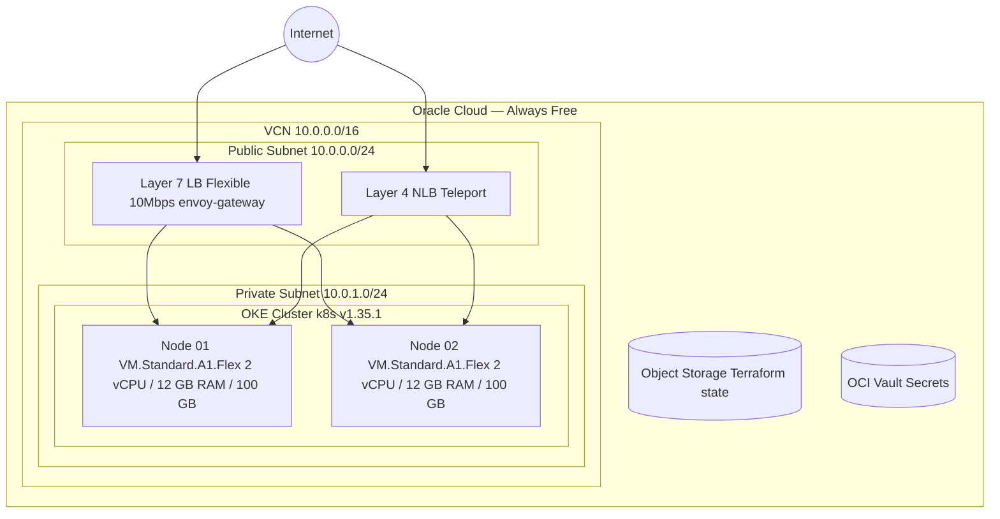
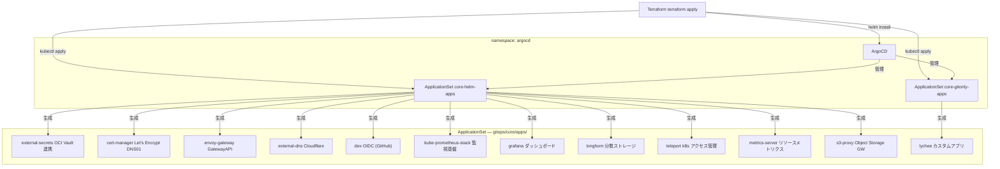
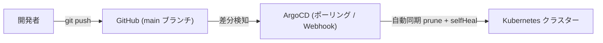
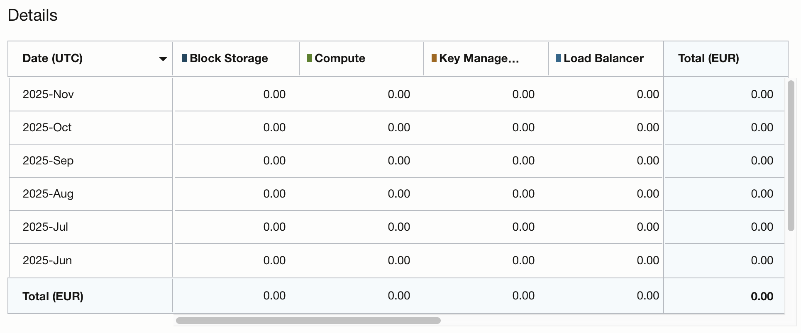

# OCI Free Tier Kubernetes クラスター

Oracle Cloud の [Always Free Tier][oci-free-tier] を利用して、**月額コスト 0 円** で Kubernetes クラスターを構築します。

[oci-free-tier]: https://docs.oracle.com/en-us/iaas/Content/FreeTier/freetier_topic-Always_Free_Resources.htm


---

## 設計概要

### クラスター構成



| リソース | スペック | 無料枠 |
|----------|----------|--------|
| OKE コントロールプレーン | マネージド | 無料 |
| Worker Node x2 | VM.Standard.A1.Flex (2 vCPU / 12GB) | 無料 |
| Boot Volume x2 | 100GB 各 | 無料 |
| Layer 7 LB | Flexible (10Mbps) | 無料 |
| Layer 4 NLB | Network LB | 無料 |
| Object Storage | Terraform state 保存用 | 無料 |

### コンポーネント構成



### Terraform 構成

```
terraform/
├── infra/          # OCI インフラ (VCN, OKE Cluster, Node Pool)
│                   # ← まずこちらを apply
└── config/         # Kubernetes 設定 (ArgoCD, External Secrets, etc.)
                    # ← infra の後に apply
```

### GitOps 構成 (ApplicationSet パターン)

```
gitops/core/
├── apps/                          # ApplicationSet generator 用パラメータファイル
│   ├── helm/                      # Helm+Git マルチソース アプリ (core-helm-apps が管理)
│   │   ├── cert-manager/config.yaml
│   │   ├── dex/config.yaml
│   │   ├── envoy-gateway/config.yaml
│   │   ├── external-dns/config.yaml
│   │   ├── external-secrets/config.yaml
│   │   ├── grafana/config.yaml
│   │   ├── kube-prometheus-stack/config.yaml
│   │   ├── longhorn/config.yaml
│   │   ├── metrics-server/config.yaml
│   │   ├── s3-proxy/config.yaml
│   │   └── teleport/config.yaml
│   └── gitonly/                   # Git のみ アプリ (core-gitonly-apps が管理)
│       ├── cert-manager-issuer/config.yaml
│       └── lychee/config.yaml
│
├── cert-manager/          # Namespace + ClusterIssuer 定義 + values.yaml
├── dex/                   # Namespace + HTTPRoute + Secret + values.yaml
├── envoy-gateway/         # Namespace + Gateway + EnvoyProxy + values.yaml
├── external-dns/          # Namespace + Secret + DNS records + values.yaml
├── external-secrets/      # Namespace + values.yaml
├── grafana/               # Namespace + HTTPRoute + Dashboards + values.yaml
├── kube-prometheus-stack/ # Namespace + HTTPRoute + SecurityPolicy + values.yaml
├── longhorn/              # Namespace + HTTPRoute + SecurityPolicy + values.yaml
├── lychee/                # Namespace + Deployment + Service
├── metrics-server/        # Namespace + values.yaml
├── s3-proxy/              # Namespace + HTTPRoute + Secret + values.yaml
└── teleport/              # Namespace + RBAC + values.yaml
```

Helm アプリは **multi-source** 形式で:
1. Helm chart レポジトリから Chart を取得 (`config.yaml` の `helmRepoURL` / `chart` / `chartVersion`)
2. このリポジトリの `gitops/core/<component>/` から追加マニフェストと `values.yaml` を取得

Git-only アプリはこのリポジトリの `gitops/core/<component>/` のみを参照します。

---

## 前提条件

### クライアント側ツール

```bash
# 必須
brew install terraform        # >= v1.12
brew install oci-cli          # OCI CLI

# 任意 (クラスターアクセス用)
brew install teleport         # tsh コマンド
brew install kubectl
```

### OCI セットアップ

```bash
# OCI CLI の初期設定
oci setup config
```

`~/.oci/config` に以下が設定されていること:

```ini
[DEFAULT]
user=ocid1.user.oc1..xxx
fingerprint=ee:f4:xx:xx
tenancy=ocid1.tenancy.oc1..xxx
region=eu-frankfurt-1
key_file=/Users/yourname/.oci/oci_api_key.pem

# Terraform OCI バックエンド用 (S3 互換)
[default]
aws_access_key_id = xxx      # OCI コンソール: ユーザー → 顧客シークレットキー
aws_secret_access_key = xxx
```

---

## デプロイ手順

### Step 1: OCI バックエンド用バケット作成

Terraform の state を保存する Object Storage バケットを作成します。

```bash
oci os bucket create \
  --name terraform-states \
  --versioning Enabled \
  --compartment-id <YOUR_COMPARTMENT_OCID>
```

### Step 2: Git リポジトリの準備

このリポジトリを fork または clone して、GitHub に push します。

```bash
git clone https://github.com/YOUR_ORG/oci-build-free-k8s.git
cd oci-build-free-k8s
git push
```

> [!NOTE]
> Git リポジトリ URL の設定は不要です。ArgoCD ApplicationSet は Terraform の `git_url` 変数から直接 URL を参照するため、ファイルの書き換えは必要ありません。

### Step 3: OCI Vault の準備

シークレット管理に OCI Vault を使用します。OCI コンソールで Vault を作成し、以下のシークレットを登録してください:

| シークレット名 | 用途 |
|----------------|------|
| `cloudflare-api-token` | External DNS / cert-manager (Cloudflare API) |
| `dex-github-connector` | Dex - GitHub OAuth App のクライアント ID/Secret |
| `dex-grafana-client` | Dex - Grafana OIDC クライアント |
| `dex-s3-proxy-client` | Dex - S3 Proxy OIDC クライアント |
| `dex-envoy-client` | Dex - Envoy Gateway OIDC クライアント |
| `alertmanager-slack-webhook` | Slack アラート Webhook URL |
| `s3-proxy-credentials` | OCI Object Storage アクセスキー |

### Step 4: terraform/infra の適用

OKE クラスターと VCN を作成します。

```bash
cd terraform/infra

# 変数ファイルを作成
cat > terraform.tfvars <<EOF
compartment_id = "ocid1.compartment.oc1..xxx"
EOF

# 初期化と適用 (約 15〜20 分)
terraform init
terraform apply
```

適用後、カレントディレクトリに `.kube.config` が生成されます。

```bash
# クラスターへの接続確認
kubectl --kubeconfig ../.kube.config get nodes
```

### Step 5: terraform/config の適用

ArgoCD と Kubernetes 設定をデプロイします。

```bash
cd terraform/config

# 変数ファイルを作成 (infra の output 値を使用)
cat > terraform.tfvars <<EOF
compartment_id = "ocid1.compartment.oc1..xxx"
tenancy_id     = "ocid1.tenancy.oc1..xxx"
vault_id       = "ocid1.vault.oc1..xxx"
public_subnet_id = "$(cd ../infra && terraform output --raw public_subnet_id)"
node_pool_id     = "$(cd ../infra && terraform output --raw node_pool_id)"
git_url          = "https://github.com/YOUR_ORG/oci-build-free-k8s.git"
EOF

terraform init
terraform apply
```

> [!TIP]
> 初回 apply 時に `ClusterSecretStore` の作成が失敗する場合があります。
> これは `external-secrets` が ArgoCD によってデプロイされる前に Terraform が実行されるためです。
> ArgoCD が `external-secrets` を正常にデプロイした後に `terraform apply` を再実行してください。

### Step 6: ArgoCD へのアクセス確認

```bash
# ArgoCD の Pod 確認
kubectl --kubeconfig ../.kube.config -n argocd get pods

# ArgoCD UI へのポートフォワード
kubectl --kubeconfig ../.kube.config -n argocd port-forward svc/argocd-server 8080:80

# 初期管理者パスワードの取得
kubectl --kubeconfig ../.kube.config -n argocd get secret argocd-initial-admin-secret \
  -o jsonpath="{.data.password}" | base64 -d
```

ブラウザで http://localhost:8080 を開き、`admin` / 上記パスワードでログインします。

`core-helm-apps` / `core-gitonly-apps` ApplicationSet が Application を生成し始めると、配下の全コンポーネントが自動デプロイされます。

### Step 7: DNS と証明書の確認

```bash
kubectl --kubeconfig ../.kube.config get certificate -A
kubectl --kubeconfig ../.kube.config get clusterissuer
```

---

## 運用

### ArgoCD による GitOps フロー



ArgoCD は定期的にリポジトリをポーリングし、差分があれば自動で適用します。

### ArgoCD CLI の使用

```bash
# ArgoCD CLI インストール
brew install argocd

# ログイン
argocd login localhost:8080 --username admin

# ApplicationSet 一覧
argocd appset list

# Application 一覧 (ApplicationSet が生成したものを含む)
argocd app list

# 特定 Application の状態確認
argocd app get cert-manager

# ApplicationSet が生成した Application を手動同期
argocd app sync cert-manager
```

### 開発ブランチへの切り替え

feature ブランチで作業する場合、Terraform の `git_revision` 変数を変更して `terraform apply` するか、両 ApplicationSet の `targetRevision` を直接パッチします:

```bash
# terraform.tfvars で変更する場合
# git_revision = "refs/heads/feature-branch" を追加して terraform apply

# kubectl で直接変更する場合
for appset in core-helm-apps core-gitonly-apps; do
  kubectl --kubeconfig ../.kube.config -n argocd patch applicationset $appset \
    --type='json' \
    -p='[{"op":"replace","path":"/spec/generators/0/git/revision","value":"refs/heads/feature-branch"}]'
done
```

### Teleport によるクラスターアクセス

Teleport が正常にデプロイされた後:

```bash
# GitHub SSO でログイン
tsh login --proxy teleport.nce.wtf:443 --auth=github-acme --user YOUR_GITHUB_USER teleport.nce.wtf

# k8s クラスターにログイン
tsh kube login oci

# 動作確認
kubectl get pods -n teleport
```

---

## Kubernetes バージョンアップグレード

> [!IMPORTANT]
> アップグレードは必ず 1 マイナーバージョンずつ段階的に行ってください。
> [K8s Skew Policy][k8s-skew] により、Worker ノードはコントロールプレーンより最大 3 バージョン古い状態が許容されます。

[k8s-skew]: https://kubernetes.io/releases/version-skew-policy/#kubelet

```bash
cd terraform/infra

# 利用可能なアップグレードバージョンを確認
oci ce cluster get \
  --cluster-id $(terraform output --raw k8s_cluster_id) \
  | jq -r '.data."available-kubernetes-upgrades"'

# _variables.tf のバージョンを更新
sed -i '' 's/default = "v1.35.1"/default = "v1.36.0"/' _variables.tf

# コントロールプレーンとノードプールをアップグレード (約 10 分)
terraform apply
```

**Worker ノードのローリングアップグレード:**

```bash
# ノード一覧を確認
kubectl get nodes

# 1台目をドレイン
kubectl drain <node-name> --force --ignore-daemonsets --delete-emptydir-data
kubectl cordon <node-name>

# OCI コンソールまたは CLI でインスタンスを終了
# (ノードプールが自動的に新しいノードを起動します)
oci compute instance terminate --force --instance-id <instance-ocid>

# 新ノードが Ready になるまで待機
kubectl get nodes -w

# Longhorn のボリュームが全て Healthy になるまで待機
kubectl get volumes.longhorn.io -A -w

# 2台目も同様に繰り返す
```

---

## コスト

Always Free Tier を正しく使用した場合の月額コスト: **¥0**



---

## 参考ドキュメント

### OCI / OKE
- [OCI Load Balancer Annotations][lb-annotations]
- [OKE Kubernetes バージョン一覧][oke-versions]

### Ingress / Gateway API
- [GatewayAPI 公式][gatewayapi]
- [Envoy Gateway][envoy-gateway]

### 証明書
- [cert-manager DNS01 チャレンジ][cert-manager-dns-challenge]

### シークレット管理
- [External Secrets Advanced Templating][secrets-templating]

### DNS
- [External DNS CRD][dns-crds]

### ArgoCD
- [ArgoCD 公式ドキュメント][argocd-docs]
- [ApplicationSet][argocd-applicationset]
- [Multi-source Applications][argocd-multi-source]

### Teleport
- [Teleport Helm デプロイ][teleport-helm-doc]
- [GitHub SSO 設定][teleport-github-sso]
- [Teleport Operator][teleport-operator]

[lb-annotations]: https://github.com/oracle/oci-cloud-controller-manager/blob/master/docs/load-balancer-annotations.md
[oke-versions]: https://docs.oracle.com/en-us/iaas/Content/ContEng/Concepts/contengaboutk8sversions.htm
[gatewayapi]: https://gateway-api.sigs.k8s.io/
[envoy-gateway]: https://gateway.envoyproxy.io/
[cert-manager-dns-challenge]: https://cert-manager.io/docs/configuration/acme/dns01/
[secrets-templating]: https://external-secrets.io/v0.15.0/guides/templating/#helm
[dns-crds]: https://kubernetes-sigs.github.io/external-dns/latest/docs/sources/crd/#using-crd-source-to-manage-dns-records-in-different-dns-providers
[argocd-docs]: https://argo-cd.readthedocs.io/
[argocd-applicationset]: https://argo-cd.readthedocs.io/en/stable/operator-manual/applicationset/
[argocd-multi-source]: https://argo-cd.readthedocs.io/en/stable/user-guide/multiple_sources/
[teleport-helm-doc]: https://goteleport.com/docs/admin-guides/deploy-a-cluster/helm-deployments/kubernetes-cluster/
[teleport-github-sso]: https://goteleport.com/docs/admin-guides/access-controls/sso/github-sso/
[teleport-operator]: https://goteleport.com/docs/admin-guides/infrastructure-as-code/teleport-operator/
